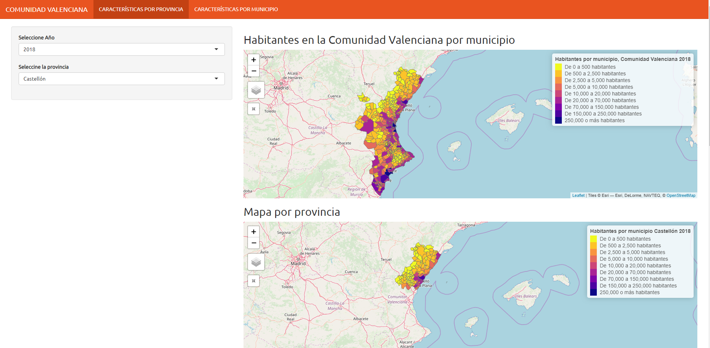
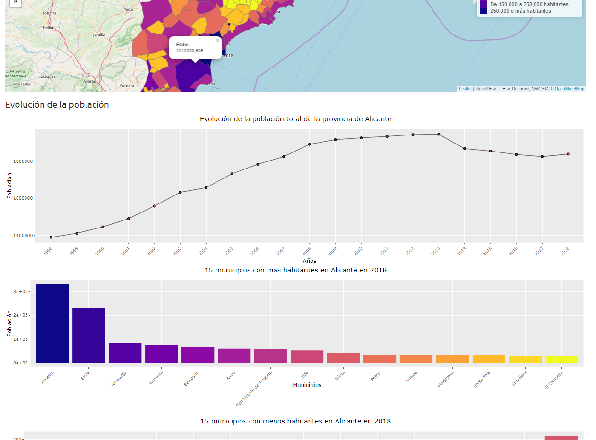
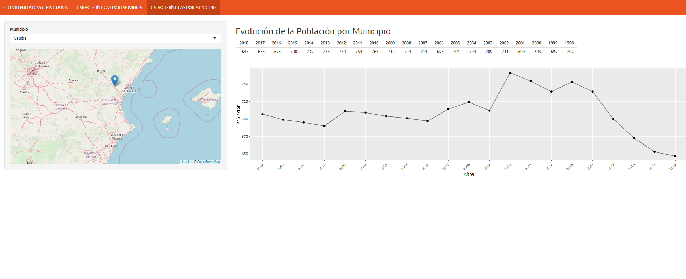
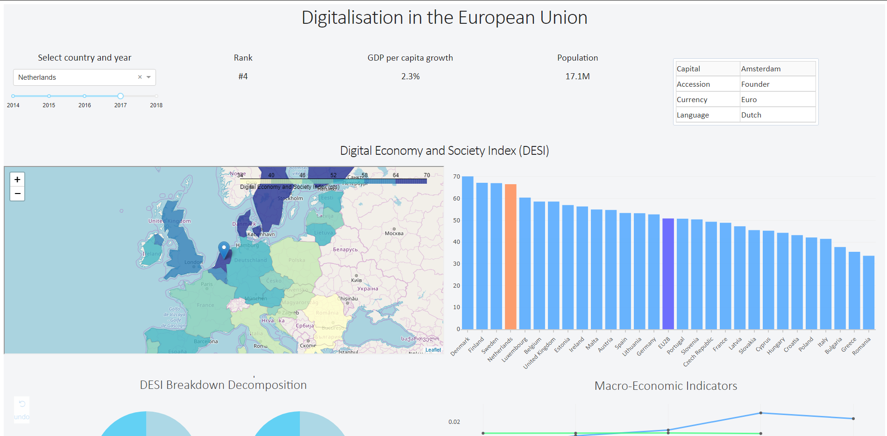
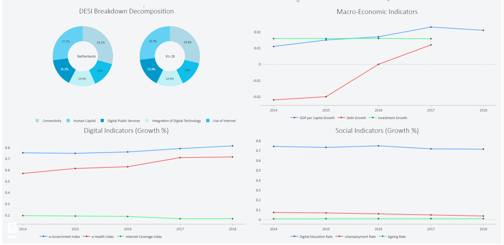
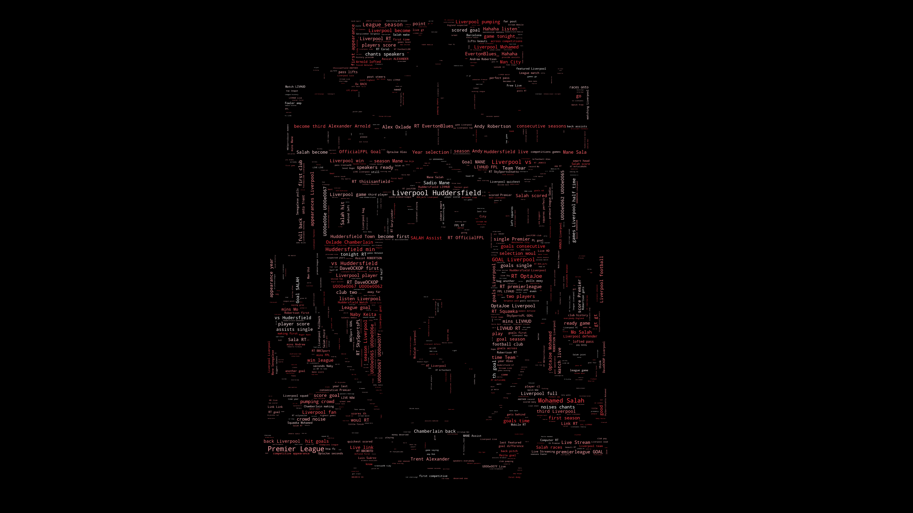
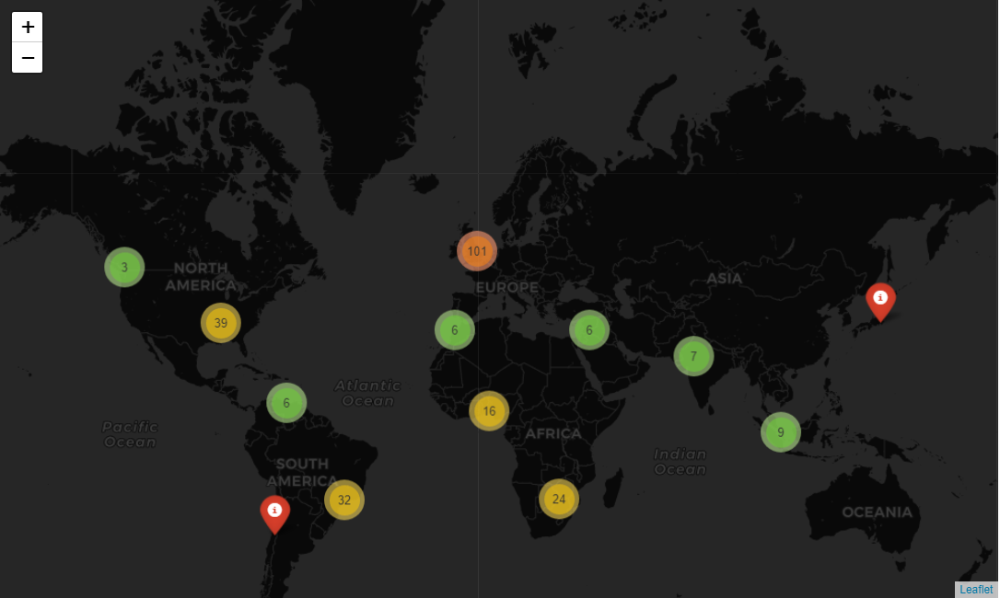
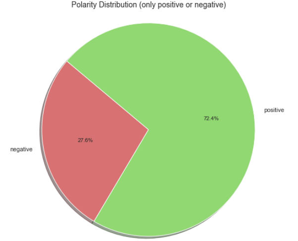
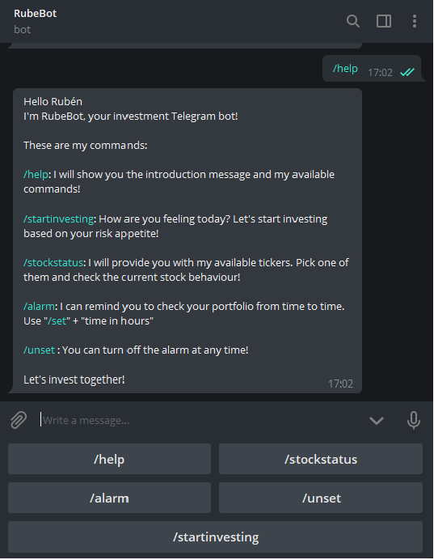
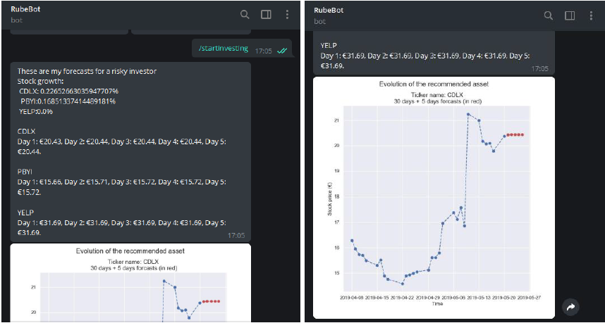

<h1 style = "text-align:center; font-size:300%"> Master_Data_Science </h1>
<h4 style = "text-align:center; font-size:150%">Rubén Giménez Martín</h4>
 

This is a repository with some examples of the projects I developed during my Master's Degree in Data Science.
 
### Table of Contents
1. [Active Learning](#al)
2. [Spark-MLlib](#mllib)
3. [Recommendation System using Pyspark](#recomm)
4. [Time Series Analysis & Prediction](#timeseries)
5. [Shiny App 1](#shiny1)
6. [Shiny App 2](#shiny2)
7. [Dash Web App](#dash)
8. [Tweets Analysis](#tweets)

### Active Learning 
To solve a classification problem combining active learning and diversity algorithms using a SVM as a base classifer.
**Active Learning algorithms:**
 
+ Margin Sampling
+ Multi-Class Label Uncertainty
+ Significance Space Construction
+ Normalized Entropy Query Bagging
 

**Diversity algorithms:**
 
+ Most Ambiguous and Orthogonal
+ Multiclass Level Uncertainty-angle-based Diversity
+ Diversity by clustering
 

### Spark-MLlib 
To load, process and evaluate different clustering and classification algorithms provided by the Spark MLlib library on the classic MNIST data set using Watson Studio.

### Recommendation System using Pyspark 
To develop a collaborative filtered type recommendation system usign the ALS algorithm (alternating least squares) provided by the Spark MLlib library.

### Time Series Analysis & Prediction 
Brief analysis and prediction of time series data related to some tourist figures in Spain.

### Shiny App 1 
An example of an interactive web app using the Shiny package.

### Shiny App 2 
Another example of an interactive web app using the Shiny package including geospatial visualisation using the Leaflet package.

### Dash Project 
Another example of an interactive web app using the Dash package and Python.

Link: https://dasheu2018desi.herokuapp.com/

### Tweets Analysis 
In this project, the capture and processing of tweets is carried out in order to measure and analyze the evolution of an sports event through Twitter.

### Investment Telegram Bot
Chatbot that acts as a personal investment assistant integrated into an instant messaging platform as Telegram.

 : @CDNG6_bot

