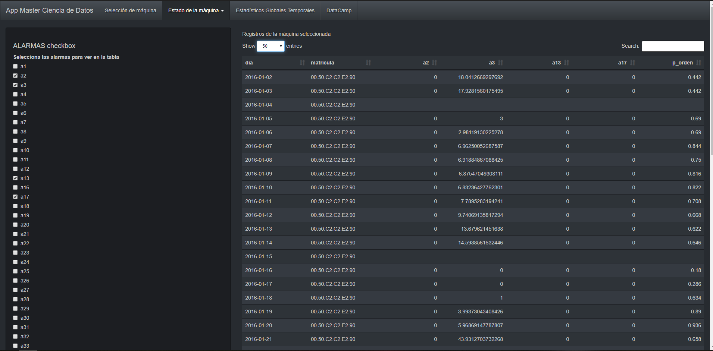

# Master_Data_Science
#### Rubén Giménez Martín
1. [Active Learning](#al)
2. [Spark-MLlib](#mllib)

This is a repository with some examples of the projects I developed during my Master's Degree in Data Science.
 
### Active Learning 
To solve a classification problem combining active learning and diversity algorithms using a SVM as a base classifer.
**Active Learning algorithms:**
 
+ Margin Sampling
+ Multi-Class Label Uncertainty
+ Significance Space Construction
+ Normalized Entropy Query Bagging
 

**Diversity algorithms:**
 
+ Most Ambiguous and Orthogonal
+ Multiclass Level Uncertainty-angle-based Diversity
+ Diversity by clustering
 

### Spark-MLlib 
To load, process and evaluate different clustering and classification algorithms provided by the Spark MLlib library on the classic MNIST data set using Watson Studio.

### Recommendation System using Pyspark
To develop a collaborative filtered type recommendation system usign the ALS algorithm (alternating least squares) provided by the Spark MLlib library.

### Time Series Analysis & Prediction
Brief analysis and prediction of time series data related to some tourist figures in Spain.

### Shiny App 1

