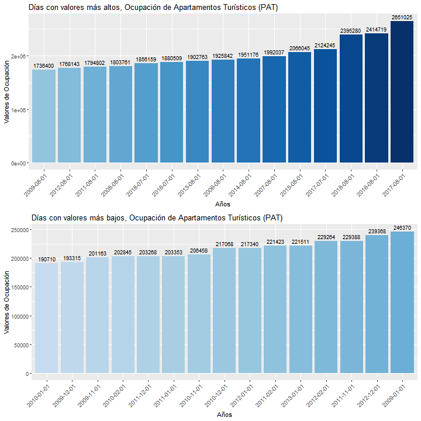
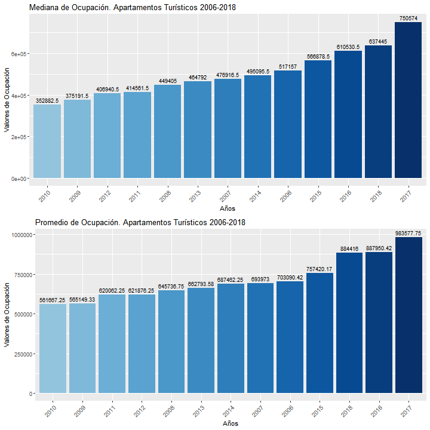
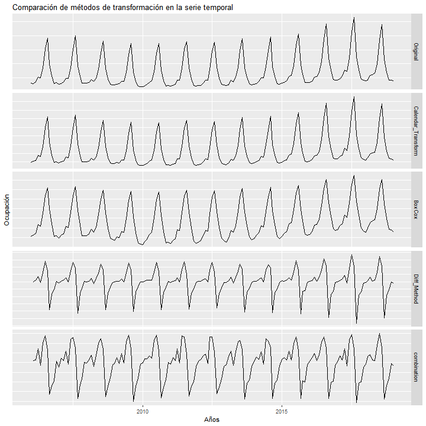

```{r setup, include=FALSE}
knitr::opts_chunk$set(echo = TRUE)
```

```{r include=FALSE}
# Packages
packages = c("lubridate","tmaptools","magrittr", "gridExtra" ,"stringdist","data.table","kableExtra","magrittr","readxl", "caret", "MLmetrics","corrplot", "tidyverse", "astsa", "forecast", "fma", "seasonal","tseries")
#use this function to check if each package is on the local machine
#if a package is installed, it will be loaded
#if any are not, the missing package(s) will be installed and loaded
package.check <- lapply(packages, FUN = function(x) {
  if (!require(x, character.only = TRUE)) {
    install.packages(x, dependencies = TRUE)
    library(x, character.only = TRUE)
  }
})

# library(MLmetrics)

rm(packages, package.check)

# setting seed
set.seed(1917)
```


```{r include=FALSE}
# classical seasonal decomposition by moving averages through the decompose function from the stats package
classical_decomposition <- function(dataset, return=FALSE) {
  
  if (frequency(dataset) == 1) {
    return('No seasonality')
  }
  
  components = decompose(dataset)
  
  if (return) {
    return(components)
  }
  
  par(mfrow=c(2,2),oma = c(0, 0, 2, 0))
  tsplot(dataset, main='Serie Original', ylab='')
  tsplot(components$trend, main='Tendencia', ylab='')
  tsplot(components$seasonal, main='Estacionalidad', ylab='')
  tsplot(components$random, main='Componente Aleatorio', ylab='')
  mtext(text = "Descomposición Clásica", outer = TRUE, cex = 1.5)
}


# moving average analysis for series trend 
ma_trend_plot <- function(dataset, orders = c(3, 7, 11, 15)) {
  regline <- lm(dataset~time(dataset))
  tsplot(dataset, main="Original Series with Regression Line")
  abline(regline,col='tomato', lwd = 2)
  ylim = c(min(dataset), max(dataset))
  orders = orders
  par(mfrow=c(2, 2))
  for (i in orders) {
    tsplot(ma(dataset, i), ylim=ylim, main=paste('K=', i))
  }
}


# function that determines series schema
schema_checker <- function(residues) {
  residues = residues[complete.cases(residues)]
  
  diffs = diff(residues, lag=1)
  divs = sapply(seq_len(length(residues) - 1), function(i) residues[i+1] / residues[i])
  # validation coefficients
  cv_diffs = sd(diffs) / mean(diffs)
  cv_divs = sd(divs) / mean(divs)
  
  if (cv_diffs < cv_divs) {
    'additive'
  }
  else {
    'multiplicative'
  }
}


# Improved version of baserR list function
List <- function(...) {
  names <- as.list(substitute(list(...)))[-1L]
  setNames(list(...), names)
}

# collect & print metrics
metric_printer <- function(fits, printer = TRUE, test){
  for (i in 1:length(fits)) {
  if(i == 1){
    Set <- c("Training Set", "Test Set")
    Method <- rep(names(fits[i]), 2)
    fitted_metrics <- accuracy(fits[[i]], test) %>% as.data.frame() %>% mutate(Set, Method) %>% select(Set, Method, RMSE, MAE, ACF1)
    
    # filtrar test y poner nombre
  }
  else {
    Set <- c("Training Set", "Test Set")
    Method <- rep(names(fits[i]), 2)
    fitted_metrics %<>% rbind(accuracy(fits[[i]], test) %>% as.data.frame() %>% mutate(Set, Method) %>% select(Set, Method, RMSE, MAE, ACF1))
  }
  
  fitted_metrics <<- fitted_metrics
  
  if(printer == TRUE & i == length(fits)) print(fitted_metrics)
  }
  
}

# Mean Squared Error, Root Mean Squared Error,  Mean Absolute Error and  Median Absolute Error
metrics <- function(model, y_pred, y_true_train = "none", y_true_test, train = FALSE){
  cat("\n\nModelo:", model,"\n--------------------------------")
  if(train == TRUE){
    #train
    print("Train Set")
    mse_ <- MLmetrics::MSE(y_pred, y_true_train)
    rmse_ <- MLmetrics::RMSE(y_pred, y_true_train)
    mae_ <- MLmetrics::MAE(y_pred, y_true_train)
    medianae_ <- MLmetrics::MedianAE(y_pred, y_true_train)
    cat("\nMSE:",mse_, "\nRMSE:", rmse_, "\nMAE:",mae_, "\nMedianAE", medianae_)
  }
  #test
  mse_ <- MLmetrics::MSE(y_pred, y_true_test)
  rmse_ <- MLmetrics::RMSE(y_pred, y_true_test)
  mae_ <- MLmetrics::MAE(y_pred, y_true_test)
  medianae_ <- MLmetrics::MedianAE(y_pred, y_true_test)
  cat("\nMSE:",mse_, "\nRMSE:", rmse_, "\nMAE:",mae_, "\nMedianAE", medianae_)
}

```

# Introducción y objetivos del ejercicio
En el siguiente ejercicio se tratará de, tras un breve análisis, predecir los valores para 2018 de la serie proporcionada en las instrucciones del ejercicio  (sobre la serie original y la serie transformada).

### Breve descripción de la serie temporal proporcionada
La serie temporal proporcionada en las instrucciones del ejercicio se caracteriza por tratarse de datos relacionados con la ocupación de apartamentos turísticos. Se desconoce las características específicas de los datos proporcionados. De la misma manera, dado que las especificaciones proporcionadas en las instrucciones no aportan más información, no se puede determinar inicialmente si se tratan de datos pertenecientes exclusivamente a la Comunidad Valenciana o a todo el Estado Español.

Por otro lado, la serie se caracteriza por proporcionar datos medidos mensualmente, es decir, para cada año comprendido en la serie se obtienen 12 registros (ciclo mensual de 12 registros).

Esta serie temporal viene acompañada de diferentes regresores mensuales, tanto de la Comunidad Valenciana como de el Estado Español. Estos regresores serán utilizados posteriormente en la fase de predicción.

Descripción inicial proporcionada:

+ Ocupación

+ Apartamentos Turísticos

+ PAT


```{r echo=FALSE}
# importing main dataset
df <- read_excel("data/Series.xlsx", sheet = "Mine", col_names = c("date", "values"), col_types = c("date", "numeric"))


# importing predictors
laptopath <- "C:/Users/rubbe/Documents/MEGAsync/MASTER/1st Year/2nd Semester/Ciencia de Datos en Negocio/TimeSeries/data"
pcpath <- "C:/Users/Usuario02/Documents/MEGAsync/MASTER/1st Year/2nd Semester/Ciencia de Datos en Negocio/TimeSeries/data"
# gathering predictor file names
predictor_names <- list.files(path = laptopath , pattern = "mensuales", all.files = FALSE, full.names = FALSE, recursive = FALSE,ignore.case = FALSE, include.dirs = FALSE, no.. = FALSE)

for (i in 1:length(predictor_names)) {
  # importing predictors asigning ES_ or CV_
 file <- read_excel(path = paste0("data/", predictor_names[i]))
 if(str_detect(string = predictor_names[i], pattern = "ES")) assign(paste0("ES_", sub('.*(\\d{4}).*', '\\1', predictor_names[i])), file)
 else assign(paste0("CV_", sub('.*(\\d{4}).*', '\\1', predictor_names[i])), file)
 rm(file)
}

rm(laptopath, pcpath, predictor_names)

```
# Análisis de la Serie Temporal

### Análisis General

El siguiente gráfico muestra la serie temporal proporcionada. En un primer vistazo, se pueden observar grandes picos a lo largo de todos los años. Mostrando una muy marcada estacionalidad, suceso que no es descabellado, dado que la ocupación turística es un fenómeno altamente estacional con picos muy altos en meses de verano y bajones significativos en los meses de invierno. 
```{r echo=FALSE}
series <- ts(data = df$values, start = c(2006,01), end = c(2018, 12),frequency = 12)
tsplot(series, main = "Ocupación Apartamentos Turísticos (PAT)", ylab = "Ocupación", xlab = "Años")
```

Se observa a continuación un resumen de los principales estadísticos de la serie.
```{r echo=FALSE}
summary(df)
```

El análisis continúa con una revisión un tanto mas exhaustiva de los máximos y mínimos de la serie, así como de su media y su mediana. En el primero de los dos conjuntos de gráficos inferiores se observa como los días con valores de ocupación mas altos, pertenecen casi exclusivamente al mes de agosto en todos los años, sin embargo, se pueden observar diferencias significativas entre los años. Se observa como los años inmediatamente posteriores a la crisis financiera de 2008 ocupan las peores posiciones, tanto en el ranking de días con más valores de ocupación como en  el de valores mas bajos. Además, se observa la progresiva recuperación del sector, presentándose en agosto de 2017 el pico histórico más alto de la serie. En el segundo conjunto de gráficos, observamos los estadísticos media y mediana de la serie. En ambos rankings copan de nuevo, los peores puestos los años posteriores a la crisis, mientras que los mejores (con mayor valor de ocupación) muestran valores pertenecientes a los años 2016, 2017, o incluso algún año inmediatamente inferior a la crisis como podría ser el año 2018. Observando este conjunto de gráficos se puede también apreciar una significativa variabilidad en la media de la serie temporal a lo largo de los años.

```{r, out.width = "100%", echo=FALSE}
color <- get_brewer_pal("Blues", n = 15, contrast = c(0.4, 1), plot = FALSE)
p1 <- ggplot(data = df %>% arrange(-values) %>% head(15), aes(x = reorder(date, values), y = values))+
  geom_col(fill = color)+ theme(legend.position = "none",axis.text.x=element_text(size = 10, angle = 45, hjust=1))+ggtitle("Días con valores más altos, Ocupación de Apartamentos Turísticos (PAT)")+
  geom_text(aes(label = values), size = 3, hjust = 0.5, vjust = -0.5, position ="stack")+labs(x = "Años", y = "Valores de Ocupación")

color <- get_brewer_pal("Blues", n = 15, contrast = c(0.25, 0.5), plot = FALSE)
p2 <- ggplot(data = df %>% arrange(values) %>% head(15), aes(x = reorder(date, values), y = values))+
  geom_col(fill = color)+ theme(legend.position = "none",axis.text.x=element_text(size = 10, angle = 45, hjust=1))+ggtitle("Días con valores más bajos, Ocupación de Apartamentos Turísticos (PAT)")+
  geom_text(aes(label = values), size = 3, hjust = 0.5, vjust = -0.5, position ="stack")+labs(x = "Años", y = "Valores de Ocupación")


# png("images/top_bottom.png",w=720,h=720)
# grid.arrange(p1, p2, ncol = 1)#+theme(plot.margin = margin(100,10,100,10))
```



```{r, echo=FALSE}
# median performance every year (sorted)
df_median <- df %>% mutate(date_y = lubridate:: year(date))
df_median %<>% select(date_y, values) %>% group_by(Fecha = as.numeric(date_y)) %>% summarise(Mediana = median(values))

color <- get_brewer_pal("Blues", n = 13, contrast = c(0.4, 1), plot = FALSE)

p1 <- ggplot(data = filter(df_median, Fecha != 2019), aes(x = reorder(Fecha, Mediana), y = Mediana))+
  geom_col(fill = color)+ theme(legend.position = "none",axis.text.x=element_text(size = 10, angle = 45, hjust=1))+ggtitle("Mediana de Ocupación. Apartamentos Turísticos 2006-2018")+
  geom_text(aes(label = Mediana), size = 3, hjust = 0.5, vjust = -0.5, position ="stack")+labs(x = "Años", y = "Valores de Ocupación")

# average performance every year (sorted)
df_avg <- df %>% mutate(date_y = lubridate:: year(date))
df_avg %<>% select(date_y, values) %>% group_by(Fecha = as.numeric(date_y)) %>% summarise(Media = mean(values))

color <- get_brewer_pal("Blues", n = 13, contrast = c(0.4, 1), plot = FALSE)

p2 <- ggplot(data = filter(df_avg, Fecha != 2019), aes(x = reorder(Fecha, Media), y = Media))+
  geom_col(fill = color)+ theme(legend.position = "none",axis.text.x=element_text(size = 10, angle = 45, hjust=1))+ggtitle("Promedio de Ocupación. Apartamentos Turísticos 2006-2018")+
  geom_text(aes(label = round(Media,2)), size = 3, hjust = 0.5, vjust = -0.5, position ="stack")+labs(x = "Años", y = "Valores de Ocupación")

# png("images/median_mean.png",w=720,h=720)
# grid.arrange(p1, p2, ncol = 1)#+theme(plot.margin = margin(100,10,100,10))

```




### Descomposición y análisis de los componentes de la serie.

A continuación, se procede a una descomposición clásica de la serie temporal original acompañada de otra descomposición más robusta a través del método STL ("Seasonal and Trend decomposition using Loess").
```{r echo=FALSE}
classical_decomposition(dataset = series)

# # classical
# series %>% decompose(type = "multiplicative") %>% autoplot()
# 
# # X11 decomposition (without x11 argument for SEATS)
# series %>% seas(x11 = "") %>% autoplot()+ggtitle("Descomposición X11")

# STL
series %>% stl(t.window = 12, s.window = "periodic", robust = TRUE) %>% autoplot()+ggtitle("Descomposición STL")
```

En ambos conjuntos de gráficos se pueden observar prácticamente los mismos comportamientos tanto para la tendencia y la estacionalidad, como para el componente aleatorio

Las características principales son: 

+ Estacionalidad anual muy marcada y constante.

+ Tendencia general no constante, decreciente en los años inmediatamente posteriores a la crisis, sucedida de una tendencia con pendiente ascendente hasta aproximadamente mediados de 2017, donde hay un claro descenso de nuevo.

+ Los residuos muestran una significativa desestabilidad en su variabilidad a partir del año 2016.

**Estudio de la tendencia**

Para observar de una mejor manera el comportamiento general del componente tendencia se ha realizado una representación gráfica de la aplicación del método de medias móviles. Se ha estimado el gráfico de k=25 como el óptimo para analizar la tendencia.

```{r echo=FALSE}
ma_trend_plot(dataset = series, orders = c(10, 15, 20, 25))
```

Como se puede comprobar, en general, todos los gráficos de las representaciones de medias móviles se ven significativamente afectados por el fuerte componente estacional. La recta de regresión representada en el primero de los gráficos muestra que, en su cómputo general, la serie muestra una ligera pero significativa pendiente ascendente.

**Estudio de la estacionalidad**

En el siguiente gráfico enfatiza los patrones estacionales de la serie.En él, las lineas horizontales azules muestran la media para cada es. Por otro lado, muestra claramente como para todos los años, los valores más altos se encuentran claramente en los meses estivales, lo que no hace más que confirmar, la clara y constante estacionalidad de la serie analizada.
```{r echo=FALSE}
ggsubseriesplot(series)+ggtitle("Seasonal Subseries plot")
```

**Estudio del componente aleatorio**

En cuanto al componente aleatorio, si se observa su gráfico de autocorrelación (gráfico inferior), se observa que se ve fuertemente afectado por la fuerte estacionalidad de la serie , por lo tanto, se puede determinar que existe una fuerte autocorrelación de memoria larga de los componentes aleatorios a lo largo de la serie temporal. 
```{r echo=FALSE}
decomposition <- series %>% stl(t.window=13, s.window="periodic", robust=TRUE)
remainder_component <- remainder(decomposition)
acf_object <- acf2(remainder_component, max.lag = length(remainder_component)-1)
```

**Conclusiones de la descomposición**

Como bien se podía intuir en el gráfico general, esta serie temporal está fuertemente afectada por un componente estacional muy marcado. En cómputo general, la serie no muestra una tendencia constante visible, sin embargo si que, aparentemente, cuenta con una ligera pendiente ascendente.
Por lo tanto se puede determinar que todos los gráficos mostrados anteriormente apuntan a que la tendencia de esta serie temporal sigue un esquema multiplicativo.

Se comprueba a continuación la siguiente información mediante el método de las diferencias y cocientes estacionales, el cual consiste en:

+ Se calculan las diferencias absolutas $X_{t+1}-X_t$ y las diferencias relativas $X{t+1}/X_t$.

+ Se calculan los cocientes de variación $CV = \frac{std}{\bar{x}}$ para las diferencias y los cocientes.

+ Si $CV(X_{t+1}-X_t)<CV(X{t+1}/X_t) \longrightarrow$Esquema aditivo

+ Si $CV(X_{t+1}-X_t)>CV(X{t+1}/X_t)\longrightarrow$Equema Multiplicativo


```{r}
schema_checker(series)
```

Se concluye que la tendencia sigue un esquema multiplicativo y que, dado que la media y la variabilidad de los datos de la serie no se mantienen constantes a lo largo del tiempo, se trata de una serie **no estacionaria**.

### Transformaciones matemáticas
En este apartado, se tratará de aislar la componente aleatoria con el objetivo de, en futuros apartados del ejercicio, conocer el comportamiento de la serie temporal a largo plazo. Este aislamiento se llevará acabo siguiendo el enfoque de Box-Jenkins, es decir, eliminando la tendencia y la parte estacional mediante transformaciones o filtros.

Las transformaciones matemáticas que se llevarán a cabo serán las siguientes:

+ Ajuste para corregir el efecto calendario calendario

+ Transformación Box-Cox para estabilizar la variabilidad de los datos.

+ Método de la diferencia para tratar de eliminar el componente tendencia.

Se observan a continuación una serie de gráficos que muestran la evolución de la serie original después de cada transformación.
```{r echo=FALSE}
# calendar adjustment
series_calendar <- series/monthdays(series)

# box cox transformation to stabilise the variance
lambda <- BoxCox.lambda(series)
series_bct <- BoxCox(series,lambda)

# differencing to avoid trend
diff_series <- diff(series)

# comnination of all of them
trf_series <- series_calendar
lambda <- BoxCox.lambda(series_calendar)
trf_series <- series_bct <- BoxCox(trf_series,lambda)
trf_series <- diff(trf_series)

# collecting all method to comarison
transf_comparison <- cbind(Original = series, Calendar_Transform = series_calendar, BoxCox = series_bct, Diff_Method = diff_series, combination = trf_series)

# plot

# png("images/transformations.png",w=720,h=720)
# autoplot(transf_comparison, facet = TRUE)+labs(title = "Comparación de métodos de transformación en la serie temporal", x = "Años", y = "Ocupación")+theme(axis.ticks.y = element_blank(), axis.text.y = element_blank())
```

 


Se comprueba ahora la descomposición STL, autocorrelación y la autocorrelación parcial de la componente aleatoria de la serie transformada. Se observa que la autocorrelación ha sido disminuida significativamente tras las transformaciones realizadas, sin embargo se observan aún palos significativos a lo largo de la serie (en lag tres, cinco y ocho), lo que indica que la serie sigue contando con cierto componente estacional. En cuanto a la autocorrelación parcial, se puede observar que se corta a partir de lag 1.
```{r echo=FALSE}
trf_series %>% stl(t.window=12, s.window="periodic", robust=TRUE) %>% autoplot()+ggtitle("Descomposición STL")

decomposition_t <- trf_series %>% stl(t.window=13, s.window="periodic", robust=TRUE)

remainder_component <- remainder(decomposition_t)

pacf_obj <- acf2(remainder_component, max.lag = length(remainder_component)-1)
```

# Predicción
Una vez llevadas a cabo las transformaciones requeridas, en este apartado se procederá a implementar diversos métodos para tratar de elaborar la mejor predicción posible para los datos de la serie en el año 2018.

Los métodos utilizados serán los siguientes:

+ Métodos simples

+ Métodos de regresión de series temporales

+ Métodos de alisado exponencial

+ Modelos ARIMA

<!-- ### Partición de train y test -->
```{r echo=FALSE}
# train - test split, from 2006 to 2017 to predict 2018, jan 2019 is out of the set
train <- window(series, start=c(2006, 1), end=c(2017, 12))
test <- window(series, start=c(2018, 1), end=c(2018, 12))

# train - test split for transformed data, from 2006 to 2017 to predict 2018, jan 2019 is out of the set
tr_train <- window(trf_series, start=c(2006, 2), end=c(2017, 12))
tr_test <- window(trf_series, start=c(2018, 1), end=c(2018, 12))
```

### Métodos simples
Los métodos simples implementados en este apartado, tanto para la serie original como para la transformada serán los siguientes:

+ Método de la media: *Las predicciones son iguales al último valor observado*.

+ Método Naïve:*Las predicciones son iguales al último valor observado*.

+ Método Naïve Estacional: *predicción igual al último valor de la misma estación*.

+ Método *Drift*: *La predicción es igual al último valor más la media del cambio. Equivale a extrapolar una línea entre la primera y la última observación, desde la última observación*.

```{r}
### Original Series ####
# Average Method
mean_fit <- meanf(train, h = 12)
# Naive Method
naive_fit <- naive(train, h = 12)
# Seasonal Naive Method
snaive_fit <- snaive(train, h = 12)
# Drift Method
drift_fit <- rwf(train, h = 12, drift=TRUE)

### Transformed Series ###
# Average Method
tr_mean_fit <- meanf(tr_train, h = 12)
# Naive Method
tr_naive_fit <- naive(tr_train, h = 12)
# Seasonal Naive Method
tr_snaive_fit <- snaive(tr_train, h = 12)
# Drift Method
tr_drift_fit <- rwf(tr_train, h = 12, drift=TRUE)
```


```{r echo=FALSE}
autoplot(train)+
  autolayer(test, series = "Original", lwd = 2, alpha = 0.8)+
  autolayer(mean_fit, series = "Mean", PI = FALSE)+
  autolayer(naive_fit, series = "Naïve", PI = FALSE)+
  autolayer(snaive_fit, series = "Seasonal Naïve", PI = FALSE)+
  autolayer(drift_fit, series = "Drift", PI = FALSE)+
  labs(title = "Métodos Simples: Predicciones sobre el año 2018 (12 meses)", subtitle = "Ocupación. Apartamentos Turísticos", x = "Años", y = "Ocupación")+
  guides(colour=guide_legend(title="Predicciones & Original"))


autoplot(tr_train)+
  autolayer(tr_test, series = "Original", lwd = 2, alpha = 0.8)+
  autolayer(tr_mean_fit, series = "Mean", PI = FALSE)+
  autolayer(tr_naive_fit, series = "Naïve", PI = FALSE)+
  autolayer(tr_snaive_fit, series = "Seasonal Naïve", PI = FALSE)+
  autolayer(tr_drift_fit, series = "Drift", PI = FALSE)+
  labs(title = "Métodos Simples: Predicciones sobre el año 2018 (12 meses).\nSerie Transformada", subtitle = "Ocupación. Apartamentos Turísticos", x = "Años", y = "Ocupación")+
  guides(colour=guide_legend(title="Predicciones & Original"))


```

```{r echo=FALSE}
metric_printer(fits = List(mean_fit, naive_fit, snaive_fit, drift_fit), test = test)
```

```{r echo=FALSE}
metric_printer(fits = List(tr_mean_fit, tr_naive_fit, tr_snaive_fit, tr_drift_fit),test = tr_test)
```

Se observa que tanto para la serie original como para la serie transformada, el método **Naïve Estacional** es el que mejor se comporta.

### Métodos de Regresión de Series Temporales

En este apartado se implementarán tres métodos de regresión lineal de series temporales. Estos métodos buscan una relación lineal entre la variable a predecir y sus predictores. Para este ejercicio, se implementarán dos modelos de regresión simple y uno de regresión múltiple:

+ $serie = \beta_o + \beta_1Tendencia + \beta_2Estacionalidad + \epsilon_t$

+ $serie = \beta_o + \beta_1Tendencia + \epsilon_t$

+ $serie = \beta_o + \beta_2Estacionalidad + \epsilon_t$

Cabe recordar, que cuando se llevan a cabo estos tipos de modelos, se hacen ciertas  suposiciones implícitas sobre las variables utilizadas.

Por un lado, se asume que que el modelo cumple una representación razonable de la realidad y que la relación entre la variable a predecir y sus predictores tienen algún tipo de relación lineal.

Por otro, se asume que los residuos del modelo se aproximan a una distribución normal de media cero, que no están autocorrelados y que no tienen relación con las variables predictoras.

Se decide ajustar los modelos a la serie transformada en este caso.

```{r}
### Transformed Series ####
tslm_1 <- tslm(tr_train ~ trend + season, data = tr_train)
tslm_2 <- tslm(tr_train ~ trend, data = tr_train)
tslm_3 <- tslm(tr_train ~ season, data = tr_train)
```

Se comprueba que los residuos sigan aproximadamente las suposiciones anteriores:
```{r echo=FALSE}
# residual evaluation
tslm_list <- List(tslm_1, tslm_2, tslm_3)

for (i in 1:length(tslm_list)) {
  cat("Evaluación de los residuos, Regresión Lineal:", i)
  checkresiduals(tslm_list[[i]], test = FALSE)
}
```

Observando las gráficas superiores se asume que los ajustes realizados por los modelos implementados no serán demasiado eficientes, ya que los residuos siempre muestran autocorrelación.

En cualquier caso, se comprueban diversos estadísticos para observar qué modelo se ajusta mejor.
```{r echo=FALSE}
for (i in 1:length(tslm_list)) {
  if(i == 1){
    performance <- CV(tslm_list[[i]]) %>% as.data.frame()
    colnames(performance)[1] <- names(tslm_list[1])
  }
  else{
    performance %<>% cbind(CV(tslm_list[[i]]))
  }
  if(i == length(tslm_list)) colnames(performance) <- names(tslm_list)
}

performance
```
Siguiendo el criterio del AIC, se determina que es el tercer modelo ($serie = \beta_o + \beta_1Estacionalidad + \epsilon_t$) el que se ajusta de mejor manera a los datos.

Se elaboran las predicciones y se representan.
```{r echo=FALSE}
prediction_1 <- forecast(tslm_1, h = 12)
prediction_2 <- forecast(tslm_2, h = 12)
prediction_3 <- forecast(tslm_3, h = 12)

autoplot(prediction_1)+
  autolayer(tr_test, series = "Original", lwd =2, alpha = 0.5)+
  labs(title = "Modelo 1",x = "Años", y = "Ocupación")+
  guides(colour=guide_legend(title=""))+
  theme(legend.position = "bottom")
autoplot(prediction_2)+
  autolayer(tr_test, series = "Original", lwd =2, alpha = 0.5)+
  labs(title = "Modelo 2",x = "Años", y = "Ocupación")+
  guides(colour=guide_legend(title=""))+
  theme(legend.position = "bottom")
autoplot(prediction_3)+
  autolayer(tr_test, series = "Original", lwd =2, alpha = 0.5)+
  labs(title = "Modelo 3",x = "Años", y = "Ocupación")+
  guides(colour=guide_legend(title=""))+
  theme(legend.position = "bottom")
```

```{r echo=FALSE}
metric_printer(fits = List(prediction_1, prediction_2, prediction_3),test = tr_test)
```

Finalmente se determina que, efectivamente, sería el tercer modelo, el cual cuenta con el componente tendencia como predictor, el que más capacidad de predicción de la serie transformada tiene.

### Métodos de Alisado Exponencial

En este apartado se implementan diversos métodos de alisado exponencial. Estos métodos se caracterizan por ser métodos que utilizan medias ponderadas de observaciones pasadas con un decaimiento exponencial de los pesos conforme las observaciones son más antiguas.

Los métodos implementados serán:

+ Método de Holt con tendencia *damped*: El método de Holt se caracteriza por ser un método de alisado exponencial simple en el cual se atribuye una tendencia a los datos predecidos. Adicionalmente, se añade el parámetro $\phi$, que "aplana" la linea de tendencia en los datos futuros con el objetivo de proporcionar mejores resultados. Se suele emplear para series sin estacionalidad y con tendencia.

+ Método de Holt-winters con tendencia aditiva *damped*: Método de alisado exponencial que también captura la estacionalidad, componiéndose de una ecuación de predicción y tres de alisado (para el nivel, la tendencia y la estacionalidad). Se utiliza para series con tendencia y estacionalidad.  

+ Se utiliza la función `ets()` (*Exponential smoothing state space model*) del paquete `forecast` con dos tipos de modelo, uno automático (ZZZ) y otro manual, especificando un esquema multiplicativo en todos los componentes y otro especificando un esquema multiplicativo en los residuos, un esquema aditivo y *damped`* en la tendencia y un esquema aditivo en la estacionalidad.

En este caso se utiliza la serie sin transformar para observar los resultados.
**Holt Damped Trend**
```{r}
holt_1 <- holt(train, damped=TRUE, phi = 0.9, h=12)
metric_printer(fits = List(holt_1), test = test)
```
```{r echo=FALSE}
autoplot(train)+
  autolayer(holt_1)+
  labs(title = "Predicción Método de Holt, Damped Trend", x = "Ocupación", y = "Años")
```

**Holt-Winters con esquema aditivo**
```{r}
hwadd <- hw(train, damped = TRUE, h = 12, phi = 0.9, seasonal="additive")
metric_printer(fits = List(hwadd), test = test)
```

```{r echo=FALSE}
autoplot(train)+
  autolayer(test, series = "Original", lwd = 2, alpha = 0.8)+
  autolayer(hwadd, series = "HoltWinters", PI = TRUE)+
  guides(colour=guide_legend(title=""))+
  labs(title = "Prediccion HoltWinters vs Original", subtitle = "Esquema Aditivo", x = "Años", y = "Ocupación")+
  theme(legend.position = "bottom")
```


**Holt-Winters con esquema multiplicativo**
```{r}
hwmult <- hw(train, damped = TRUE, h = 12, phi = 0.9, seasonal="multiplicative")
metric_printer(fits = List(hwmult), test = test)
```
```{r echo=FALSE}
autoplot(train)+
  autolayer(test, series = "Original", lwd = 2, alpha = 0.8)+
  autolayer(hwmult, series = "HoltWinters", PI = TRUE)+
  guides(colour=guide_legend(title=""))+
  labs(title = "Prediccion HoltWinters vs Original", subtitle = "Esquema Multiplicativo", x = "Años", y = "Ocupación")+
  theme(legend.position = "bottom")
```
 
**Exponential smoothing state space model (ETS)**
```{r}
# MMA
ets_maa <- ets(y = train, model = "MAA", allow.multiplicative.trend = FALSE)

# MMM
ets_damped_mma <- ets(y = train, model = "MMM", damped = TRUE, phi = 0.93 ,allow.multiplicative.trend = TRUE)

# Automatic
ets_auto <- ets(y = train, model = "ZZZ", damped = TRUE, allow.multiplicative.trend = TRUE)

ets_models <- List(ets_maa, ets_damped_mma, ets_auto)
```

Comprobación a través del estadístico AIC de que modelo ETS produciría mejores resultados:
```{r echo=FALSE}
for (i in 1:length(ets_models)){
  cat("AIC, ETS Model",i,"->", AIC(ets_models[[i]]),"\n")
} 
```

Se observa que es el modelo automático el que obtiene un AIC más bajo, por lo tanto, se muestran a continuación sus características.
```{r echo=FALSE}
summary(ets_auto)
```

Finalmente, se decide realizar la predicción utilizando el modelo automático:
```{r echo=FALSE}
prediction_1 <- ets_auto %>% forecast(h = 12)
metric_printer(fits = List(prediction_1), test = test)
```
```{r echo=FALSE}
autoplot(prediction_1)+
  labs(x = "Años", y = "Ocupación")+
  autolayer(test, series = "Original", lwd =2, alpha = 0.5)+
  guides(colour=guide_legend(title=""))+
  theme(legend.position = "bottom")
```

En este caso, es el Método Holt-Winters que sigue un esquema multiplicativo de la tendencia el que proporciona mejores resultados de predicción, siendo el método de holt el que produce peores resultados, situación que es obvia dada la alta estacionalidad de la serie, la cual no es capaz de capturar.

### Modelos ARIMA
En este apartado se tratará de implementar algunos modelos ARIMA (Autoregressive integrated moving average), se recuerda que estos modelos tienen como objetivo describir las asutocorrelaciones en los datos.

Como ya se comentó en anteriores apartados del ejercicio, la serie temporal analizada se caracteriza por ser no estacionaria, por lo tanto, para tratar de obtener mejores resultados con modelos ARIMA, se utilizará la serie aplicando inicialmente una transformación Box-Cox para obtener una serie con una variabilidad más estabilizada.

Se calcula el Test de Dickey–Fuller aumentado para comprobar que, efectivamente, se trata de una serie no estacionaria.


[Test de Dickey–Fuller aumentado:](https://en.wikipedia.org/wiki/Augmented_Dickey%E2%80%93Fuller_test)
```{r echo=FALSE}
# is stationarity present? it looks like it is, but let's check what our Augmented Dickey–Fuller little fellow says about this thing
adf.test(series, alternative = "stationary", k = 12)
```

Se realizarán, en este caso, dos modelos ARIMA, el primero de ellos utilizando la función `auto.arima()` del paquete `forecast` y la función `seas()` del paquete `seasonal`, la cual llama a los procedimientos del software  X-13ARIMA-SEATS.

**1. Modelo ARIMA automático**
```{r echo=FALSE}
# train - test split, from 2006 to 2017 to predict 2018, jan 2019 is out of the set. Original Series with Box Cox Transformation
bc_train <- window(series_bct, start=c(2006, 1), end=c(2017, 12))
bc_test <- window(series_bct, start=c(2018, 1), end=c(2018, 12))
```
Se lanza el modelo automático y se observan los resultados.
```{r}
arima_auto <- auto.arima(bc_train, seasonal = TRUE)
arima_auto
```

Se comprueban a continuación los residuos del modelo automático creado.
```{r echo=FALSE}
checkresiduals(arima_auto)
```

Como se puede observar, la autocorrelación de los residuos es significativamente débil. Por otro lado, si se observa el test Ljung-Box proporcionado por la función `checkresiduals()` del paquete `forecast`, el cual interpreta como hipótesis nula a independencia de os datos, se puede determinar que con un p-valor de 0.06279, no se obtiene significancia estadística para apoyar la hipótesis alternativa de dependencia. Por lo tanto, se determina que este modelo puede aportar un comportamiento eficiente en la predicción.

Se observa a continuación los resultados de la predicción:
```{r echo=FALSE}
arima_auto_prediction <- arima_auto %>% forecast(h=12)
metric_printer(fits = List(arima_auto_prediction), test = bc_test)
```

```{r echo=FALSE}
autoplot(arima_auto_prediction)+
  autolayer(bc_test, series = "Original", lwd =2, alpha = 0.5)+
  labs(x = "Años", y = "Ocupación")+
  guides(colour=guide_legend(title=""))+
  theme(legend.position = "bottom")
```

**2. Software  X-13ARIMA-SEATS**

1. X-13ARIMA-SEATS con los predictores proporcionados en el ejercicio

Se decide utilizar predictores nacionales a partir de 2006. Por razones de funcionamiento se utiliza la serie original.
```{r echo=FALSE}
# predictors are saved up as a ts object from the original data frame
predictores <- matrix(0,36,ncol(ES_2006[,-1]))
colnames(predictores) <- colnames(ES_2006[,-1])
reg <- rbind(ES_2006[,-1], predictores)
reg <- ts(data = reg, start=c(2006,1),end = c(2021,12), frequency = 12)
```

```{r}
seas_model_1 <- seas(train, xreg=reg[, c("dias.habiles", "Bisiesto")], regression.aictest = c("td"))
```

Si se observan los predictores del modelo, en este caso los residuos presentan una autocorrelación significativa.
```{r echo=FALSE, warning=FALSE}
checkresiduals(seas_model_1)
```

En cualquier caso, se lleva a cabo la predicción
```{r echo=FALSE}
prediction_seas_1 <- seasonal::series(seas_model_1, "forecast.forecasts", verbose = FALSE)

metrics(model = "X13-ARIMA", y_pred = prediction_seas_1[,1] %>% as.vector(), y_true_test = test %>% as.vector())
```


```{r}
autoplot(train)+
  autolayer(test, series = "Original", lwd =2, alpha = 0.5)+
  autolayer(prediction_seas_1[,1], series = "Predicción")+
  labs(title = "X13-ARIMA: Modelo 1",x = "Años", y = "Ocupación")+
  guides(colour=guide_legend(title=""))+
  theme(legend.position = "bottom")
```


2. X-13ARIMA-SEATS con predictores incluidos en el software 

En este caso,  se prueban varios modelos y se determina que, de los regresores incluidos en el software, los que muestran mejores resultados son *seasonal* y el *trading day*. Para este casi, sí es posible utilizar los la serie transformada con la transformación Box-Cox.
```{r}
# box cox tranasform is used again
seas_model_2 <- seas(bc_train, regression.variables = c("td", "seasonal"))
```
Observamos a continuación cómo los residuos del modelo no muestran autocorrelación significativa.
```{r, warning=FALSE, echo=FALSE}
checkresiduals(seas_model_2)
```

Se procede al realizar la predicción y observar sus resultados.
```{r echo=FALSE}
prediction_seas_2 <- seasonal::series(seas_model_2, "forecast.forecasts", verbose = FALSE)

metrics(model = "X13-ARIMA, Conjunto de test", y_pred = prediction_seas_2[,1] %>% as.vector(), y_true_test = bc_test %>% as.vector())
```

```{r echo=FALSE}
autoplot(bc_train)+
  autolayer(bc_test, series = "Original", lwd =2, alpha = 0.5)+
  autolayer(prediction_seas_2[,1], series = "Predicción")+
  labs(title = "X13-ARIMA: Modelo 2",x = "Años", y = "Ocupación")+
  guides(colour=guide_legend(title=""))+
  theme(legend.position = "bottom")

```

Como se puede observar, este es el modelo que **mejor** predicción muestra de todos los modelos llevados a cabo durante el ejercicio.

### Modelos con Cross-Validation

Finalmente se toman los 4 modelos que, durante el ejercicio se ha observado que tienen mejor capacidad de predicción para llevar a cabo un proceso de Time Series Cross Validation, en el cual, primeramente se tomarán los datos hasta el año 2017 (prediciendo secuencialmente, y para los diferentes horizontes, los valores de 2016 y 2017, utilizando exclusivamente los valores previos de la serie) para comprobar los errores en el conjunto de comprobación para los diversos horizontes (1-12 meses). 

Para llevar a cabo este proceso se tomará la serie transformada con la transformación Box-Cox.

Los modelos que se han decidido tomar para este apartado han sido:

+ Seasonal Naïve

+ Holt-Winters con esquema multiplicativo

+ El modelo generado con la función `auto.arima()` de la librería `forecast`

+ El segundo modelo generado en el apartado de los modelos X-13ARIMA-SEATS

Se lleva a cabo el proceso y se representa el gráfico de los errores (MAE) para los diferentes horizontes en el conjunto de comprobación:

```{r warning=FALSE}
# set data partition 

train <- window(series_bct, start=c(2006, 1), end=c(2017, 12))
validation <- window(series_bct, start=c(2018, 1), end=c(2018, 12))

# setting connfig
k <- 132 
n <- length(series_bct) 
mae1 <- mae2 <- mae3 <- mae4 <- matrix(NA,n-k,12) 


for(i in 0:(n-k-1)) {
  # train-test partition
  train_cv <- window(train, end=2015+11/12+i/12)
  test <- window(train, start=2015+11/12+(1+i)/12, end=2016+10/12+(1+i)/12)
  
  # seasonal naive
  fit1 <- snaive(train_cv, h = 12)
  fcast1 <- forecast(fit1,h = 12) 
  
  # Holt Winters
  fit2 <- hw(train_cv, damped = TRUE, h = 12, phi = 0.9, seasonal="multiplicative")
  fcast2 <- forecast(fit2,h=12)
  
  # Auto.Arima
  fit3 <- auto.arima(train_cv, seasonal = TRUE)
  fcast3 <- forecast(fit3,h=12)
  
  # X13-ARIMA Model 2
  fit4 <- seas(train_cv, regression.variables = c("td", "seasonal"))
  fcast4 <- seasonal::series(fit4, "forecast.forecasts")
  fcast4 <- window(fcast4[,1], end = end(test))

  
  mae1[i+1,] <- c(abs(fcast1$mean-test),rep(NA,12-length(test)))
  mae2[i+1,] <- c(abs(fcast2$mean-test),rep(NA,12-length(test)))
  mae3[i+1,] <- c(abs(fcast3$mean-test),rep(NA,12-length(test)))
  mae4[i+1,] <- c(abs(fcast4-test),rep(NA,12-length(test)))
} 


plot(1:12, apply(mae1, 2, mean, na.rm=T), type="l", col="red", xlab="Horizontes",ylab="MAE", main = "MAE en Cross Validation (1-12 horizontes)", ylim = c(1, 6))
lines(1:12, apply(mae2, 2, mean, na.rm=T), type="l", col="blue", ylim = c(1, 6))
lines(1:12, apply(mae3, 2, mean, na.rm=T), type="l", col="green", ylim = c(1, 6))
lines(1:12, apply(mae4, 2, mean, na.rm=T), type="l", col="yellow", ylim = c(1, 6))
legend("bottomright", legend=c("Seasonal Naive","Holt Winters","Auto ARIMA", "X13-ARIMA Model 2"), col=c("red", "blue", "green", "yellow"), lty=1)
```

Como se puede observar, el segundo modelo X13-ARIMA es el que, durante mas horizontes, es capaz de mantener los errores más bajos, sin embargo, a partir del horizonte de los 9 meses aproximadamente, es significativo observar como el modelo generado con el procedimiento de ARIMA automático de la librería `forecast`, en promedio,consigue mejores resultados.

Finalmente, se realizan las predicciones para el año 2018 y se observan los errores para sus 12 horizontes.
```{r warning=FALSE}
# predictions
auto_arima_final <- fit3 %>% forecast(h = 13)
auto_arima_final <- auto_arima_final$mean[2:13]


fcast4 <- seasonal::series(fit4, "forecast.forecasts")
fcast4 <- window(fcast4[,1], end = c(2018, 12)) %>% as.vector()
fcast4 <- fcast4[2:13]

# mae for different horizons
autoarima_mae <- abs(setdiff(auto_arima_final, validation %>% as.vector()))
x13_mae <- abs(setdiff(fcast4, validation %>% as.vector()))

plot(1:12, autoarima_mae, type = "l", col = "red", main = "Predicciones conjunto de Validación 2018", xlab = "Horizontes", ylab = "MAE")
lines(1:12, x13_mae, type = "l", col = "blue")
legend("topleft", legend=c("Auto ARIMA", "X13-ARIMA Model 2"), col=c("red", "blue"), lty=1)
```

Finalmente, como se puede observar, ambos modelos muestran resultados similares, sin embargo, exceptuando la predicción a tres horizontes vista, para el año 2018 es el segundo modelo X13-ARIMA el que produce mejores resultados. Por lo tanto, sería este último modelo el elegido en el ejercicio como modelo final para la predicción de estos datos.

